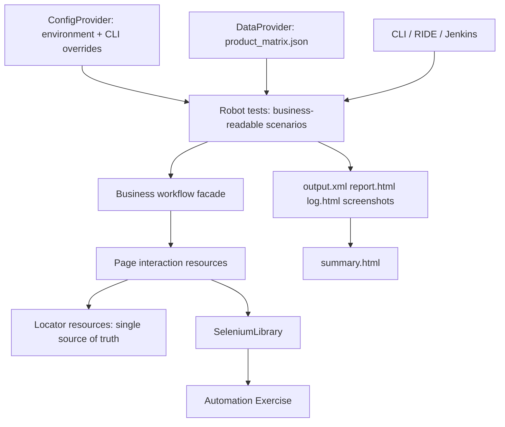

# Cartograph QA

**Evidence-led Robot Framework e-commerce journeys.**

Cartograph QA is a modular Robot Framework and SeleniumLibrary capstone that automates the required e-commerce journey: launch browser, login, search, add to cart, verify cart, logout, and close browser. It uses [Automation Exercise](https://automationexercise.com/) - one of the applications suggested in the official assignment - and intentionally separates test intent, business workflows, page interactions, locators, data, and execution infrastructure.

Repository description: A configuration-driven Robot Framework e-commerce suite with external data, page-layered keywords, failure evidence, native reports, and parameterized Jenkins execution.

## Assignment scope

The supplied capstone document is the authority. It explicitly requires Robot Framework basics, SeleniumLibrary, RIDE, keyword- and data-driven testing, resource files, user-defined keywords, setup/teardown, the POM concept, Jenkins and command-line execution, reporting, and the prescribed e-commerce flow. It suggests Automation Exercise or Demo Web Shop; this project chooses Automation Exercise. The document does **not** prescribe a directory design, data file format, browser, environment model, dashboard, retry policy, or parallelism. Those items below are documented enhancements, not rewritten requirements.

## Why this is not a basic submission

| Engineering choice | Value | Category |
| --- | --- | --- |
| Four-layer architecture | Keeps business intent separate from Selenium details | Enhancement; strengthens POM, resources and keywords |
| Workflow facade | Tests read like business specifications | Enhancement; strengthens keyword-driven testing |
| JSON data provider | Data is independent of tests and can grow without copy/paste | Enhancement; strengthens data-driven testing |
| Central locator resources | A UI locator change has one edit location | Enhancement; strengthens POM |
| Configuration strategy | CLI/environment settings choose browser, environment, timeout and headless mode without test edits | Enhancement |
| Failure evidence contract | Screenshot folder, test name and native Robot keyword log make failures diagnosable | Enhancement; strengthens reporting |
| Metadata summary | A small local dashboard supplements - never replaces - Robot reports | Enhancement; strengthens reporting |
| Parameterized Jenkins | Reproducible browser/environment/tag execution and artifact retention | Mandatory Jenkins requirement, professionally implemented |

The project intentionally has no automatic test retry: retries can hide real defects. SeleniumLibrary's explicit waits handle expected rendering delay. It also intentionally omits Pabot: the public site plus a shared test account/cart makes sequential execution safer and easier to demonstrate. The test design is isolated per test browser session, so parallelism can be revisited later with distinct accounts and isolated cart data.

## Architecture



This is a Robot-appropriate Page Object Model: page resources own interactions, locator resources own selectors, and business resources own cross-page workflows. Test cases do not contain Selenium locators or clicks.

## Structure

```text
Cartograph-QA/
  config/                 environment profiles and secret template
  data/                   external product matrix
  libraries/              configuration/data variable files and summary generator
  resources/
    locators/             one source of truth for selectors
    pages/                page interactions
    keywords/             business facade and framework lifecycle
  tests/                  readable data-driven Robot suite
  Jenkinsfile             parameterized Windows Jenkins pipeline
```

## Setup

This checkout lives at `C:\Users\User\Downloads\New project\Cartograph-QA`.

1. Install Python 3.11 (recommended) and Chrome or Firefox. This machine already has Python 3.11.9 at `C:\Users\User\AppData\Local\Programs\Python\Python311\python.exe`.
2. Use the **local** virtual environment `.venv-local`. Do not use `.venv` from the original zip — it still points at `C:\Users\uttar\OneDrive\Documents\New project\Cartograph-QA\.venv` and `C:\Program Files\Python313\python.exe`.

   ```powershell
   Set-Location "C:\Users\User\Downloads\New project\Cartograph-QA"
   py -3.11 -m venv .venv-local
   .\.venv-local\Scripts\Activate.ps1
   python -m pip install -r requirements.txt
   ```

   From the parent `New project` folder you can also run `.\run_cartograph.ps1`.

3. Copy `config/.env.example` to `.env`. Create a dedicated Automation Exercise user once via its UI, then set `AE_EMAIL` and `AE_PASSWORD`. Never commit `.env`.
4. Selenium Manager (included with current Selenium) normally obtains the matching driver. If a managed computer blocks this, install a browser driver compatible with the browser and put it on `PATH`.

### RIDE

Install it with the same environment: `pip install robotframework-ride`. On wxPython 4.3, run `python scripts\\fix_ride_wx.py` once after installation, then launch `.\\.venv-local\\Scripts\\ride.exe`. Open this repository folder (`C:\Users\User\Downloads\New project\Cartograph-QA`) and `tests/data_driven_cart.robot`. Run a tagged test or the suite, then open `results/report.html` and `results/log.html`. In RIDE, show the test template, imported resource tree, and business keyword definitions - that visibly demonstrates readable keyword-driven design rather than raw WebDriver calls.

## Configuration and execution

`ConfigProvider.py` selects the `qa` profile by default. Robot `-v` variables override the provider, which supplies the strategy-style browser/environment choices without test changes.

```powershell
# Full suite (default Chrome, qa, headless)
robot -d results tests

# Single suite / individual test / meaningful tag selection
robot -d results tests\data_driven_cart.robot
robot -d results -t "Blue Top purchase journey" tests
robot -d results -i smoke tests
robot -d results -i login tests
robot -d results -i cart tests

# Browser, profile, headless mode and alternate output folder
robot -d results-firefox -v BROWSER:firefox -v ENVIRONMENT:demo -v HEADLESS:false tests
```

Supported tags: `smoke`, `regression`, `critical`, `login`, `search`, `cart`, `negative`, `data-driven`, and `ecommerce`. The suite-level tags identify all journeys, including their common login workflow; case-level tags identify the critical/cart/search/negative purpose. This makes `-i login` a meaningful way to select only journeys exercising authenticated behavior as the suite grows.

## Data-driven matrix

`data/product_matrix.json` is the source. `DataProvider.py` converts it to `PRODUCT_CASES`, and the Robot test template executes the same business facade once per named case.

| Dataset | Search | Expected behavior | Cart assertion |
| --- | --- | --- | --- |
| blue_top | Blue Top | Results exist | Blue Top present |
| men_tshirt | Men Tshirt | Results exist | Tshirt product present |
| unknown_product | Cartograph Imaginary Product 2026 | No product cards | Not applicable |

To add a positive case, add a JSON object and a one-line template row; test logic remains unchanged. The negative case deliberately validates search behavior only because adding a nonexistent product is not a valid cart journey.

## Reports and failure diagnosis

Robot generates `results/output.xml`, `results/report.html`, and `results/log.html`. On failure, teardown captures a PNG under `results/screenshots/`, logs the failed test/business journey, and closes the browser. Generate the complementary dashboard after any local run:

```powershell
py libraries\generate_summary.py --output results\output.xml --result-dir results --browser chrome --environment qa --build local
```

Open `results/summary.html`. It lists totals, metadata, test result messages, screenshots, and links to Robot's authoritative native reports.

## Jenkins

Use a Windows Jenkins agent with Python and Chrome/Firefox installed. Install Jenkins plugins **Robot Framework** and **HTML Publisher**. Create a Pipeline job from SCM, point it at `Jenkinsfile`, and create a Username/Password credential with ID `automation-exercise-test-user`. The pipeline parameters select browser, environment, tag, and headless state; it installs dependencies, executes Robot, generates `summary.html`, archives `results/**`, publishes the dashboard/native Robot report, and leaves failures as failed builds.

For a scheduled run, configure Jenkins `Build periodically` after the initial successful manual build. Credentials are injected only during execution and never stored in the repository.

## Demonstration checklist (5-10 minutes)

1. State the required business flow and that Automation Exercise is an official suggested app.
2. Show the architecture diagram and the `resources` layers.
3. Open `tests/data_driven_cart.robot`: the three tests read as data plus one business workflow.
4. Open `business_flows.resource`, then a page resource and locator resource to show the facade/POM separation.
5. Open `product_matrix.json` and `environments.json`; explain data/config are external.
6. Run `-i smoke` headed to show the browser journey.
7. Run `-v BROWSER:firefox -v HEADLESS:true` to demonstrate configuration strategy (with Firefox installed).
8. Open `report.html`, `log.html`, screenshot evidence, and `summary.html`.
9. Open RIDE and show the suite/resource imports and a run result.
10. Open the parameterized Jenkins job, describe credential handling/artifacts, and close with the deliberate no-retry/no-Pabot reliability decisions.

## Troubleshooting

| Cause | Diagnosis | Fix |
| --- | --- | --- |
| `robot` not found | `robot --version` fails | Activate `.venv-local`; use `.venv-local\\Scripts\\robot.exe`. Do not use the zip's `.venv`. |
| Login fails | Screenshot/log shows login page or error | Check dedicated account and `AE_EMAIL`/`AE_PASSWORD`; do not commit them |
| Driver/browser mismatch | Selenium session cannot start | Update Selenium/browser; allow Selenium Manager or configure a matching driver on `PATH` |
| Locator change | Log says element not found | Inspect the screenshot/site, then update only `resources/locators/*.resource` |
| Slow page | Explicit wait times out | Increase `TIMEOUT` by CLI/config; do not add `Sleep` |
| JSON typo | Variable/data error before browser actions | Validate `data/product_matrix.json` and required keys |
| Unknown profile | ConfigProvider raises ValueError | Use `qa` or `demo`, or add a complete profile |
| RIDE does not launch | Package/install error | Reinstall inside the active venv; use CLI for execution if the desktop package is incompatible |
| Jenkins report missing | Post action has no output.xml | Check the Run Robot stage and Windows agent workspace; preserve `results/**` |
| Git secret exposure | `.env` appears in status | Remove it from tracking, rotate the password, retain only `.env.example` |

## Resume descriptions

**Short:** Built Cartograph QA, a Robot Framework/Selenium e-commerce suite with external data, page-layered keywords, evidence capture, and parameterized Jenkins reporting.

**Standard:**

- Designed a Robot Framework Page Object Model with locator, page-interaction, and business-workflow layers for readable e-commerce journeys.
- Implemented JSON-driven test scenarios, CLI-configurable Chrome/Firefox execution, failure screenshots, native Robot reports, and Jenkins artifact publishing.

**Technical:**

- Architected a configuration-driven Robot Framework + SeleniumLibrary automation suite using Python variable providers, external JSON test data, reusable resource files, and workflow-facade keywords.
- Delivered a parameterized Jenkins pipeline for browser/environment/tag selection, secure credential injection, report publishing, and archived execution evidence.
- Improved diagnosability with test-isolated browser sessions, explicit waits, centralized selectors, screenshots on failure, and a local `output.xml` summary dashboard.

## Team and license

Replace this section with team member names, roles, and repository contribution rules before publishing. Use an MIT license only if your institution permits it and the team agrees.
